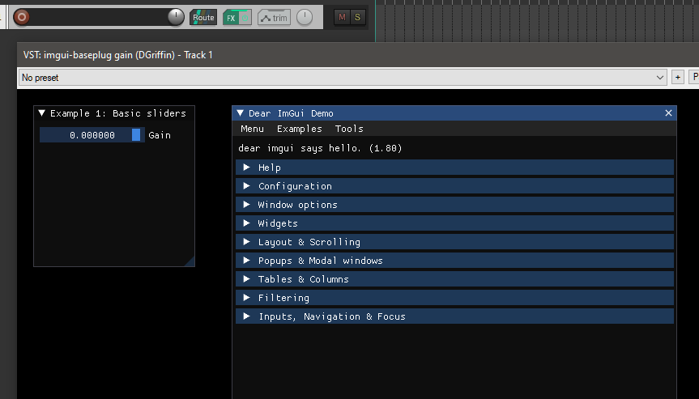

# imgui_baseplug_baseview_test

Based on [imgui_baseview_test_vst2](https://github.com/DGriffin91/imgui_baseview_test_vst2)

Barebones [baseview](https://github.com/RustAudio/baseview)/[imgui_baseview](https://github.com/BillyDM/imgui-baseview)
[baseplug](https://github.com/wrl/baseplug) plugin.

It implements a [imgui-rs](https://github.com/imgui-rs/imgui-rs) ui for the [gain effect example](https://github.com/wrl/baseplug/blob/trunk/examples/gain.rs)

The plugin logs events to `~/tmp/IMGUIBaseplugBaseviewTest.log`.

## Usage: macOS (Untested)

- Run `scripts/macos-build-and-install.sh`
- Start your DAW, test the plugin

## Usage: Windows

- Run `cargo build`
- Copy `target/debug/imgui_baseview_test_vst2.dll` to your VST plugin folder
- Start your DAW, test the plugin

## Usage: Linux (Untested)

- Run `cargo build`
- Copy `target/debug/imgui_baseview_test_vst2.so` to your VST plugin folder
- Start your DAW, test the plugin

